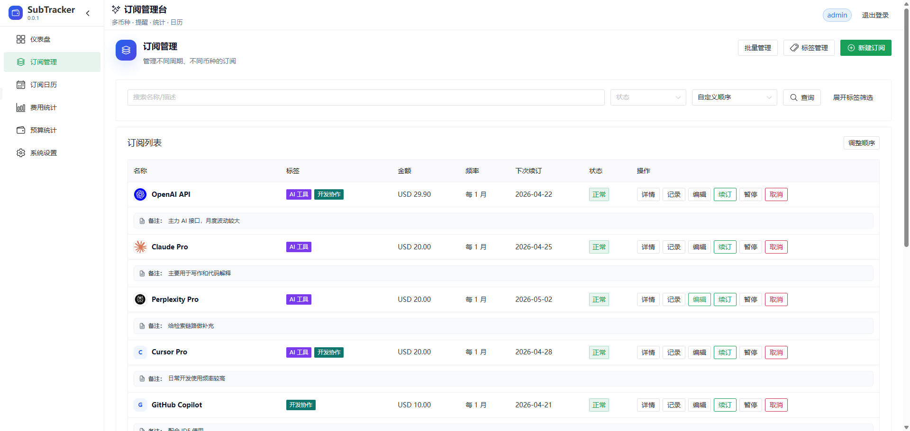
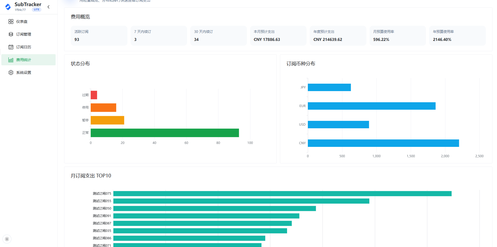
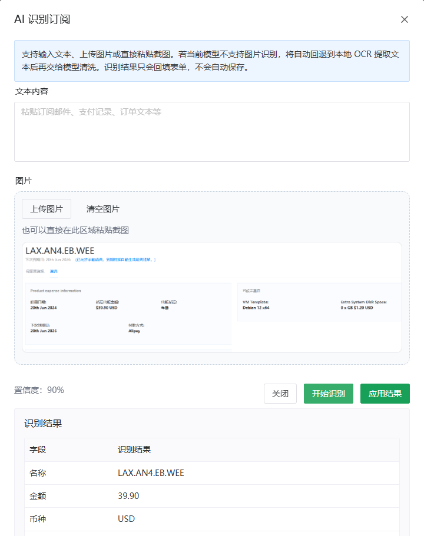
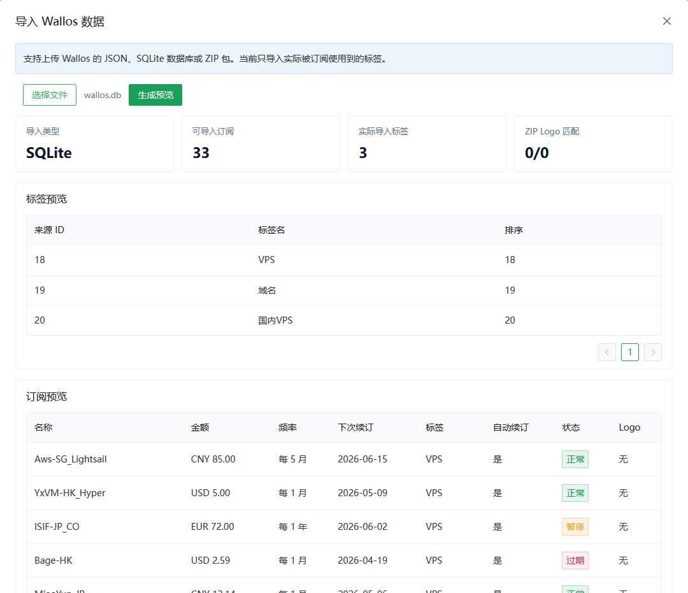

<p align="center">
  
</p>

<h1 align="center">SubTracker</h1>

<p align="center">
  一个现代化的自托管订阅管理工具，用来统一管理多币种订阅、续订提醒、预算分析、Logo 资源，以及 Wallos 数据迁移
</p>

<p align="center">
  
  
  
</p>

<p align="center">
  <a href="#本地开发">本地开发</a> ·
  <a href="#部署">部署</a> ·
  <a href="./DEPLOYMENT.md">部署文档</a> ·
  <a href="https://github.com/Smile-QWQ/SubTracker/releases">Releases</a>
</p>

> 当前 `main` 分支提供 **Docker / Docker Compose** 部署；如果你需要 **Cloudflare Worker 无服务器部署**，请前往 [`lite`](https://github.com/Smile-QWQ/SubTracker/tree/lite) 分支，对应的部署说明、工作流与 Worker 适配实现都维护在该分支

## 快速开始

### 想直接部署

```bash
curl -fsSL https://raw.githubusercontent.com/Smile-QWQ/SubTracker/main/scripts/install.sh | bash
```

- 推荐使用 **完整部署（full）**
- 支持 **x86 / ARM** 双架构
- 详细步骤见 [`DEPLOYMENT.md`](./DEPLOYMENT.md)

### 想本地开发

```bash
npm install
npm run prisma:generate
npm run prisma:push
npm run prisma:seed
npm run dev
```

默认地址：

- Web：`http://127.0.0.1:5173`
- API：`http://127.0.0.1:3001`

默认账户：

- 用户名：`admin`
- 密码：`admin`

## 界面预览

### 仪表盘


### 更多截图

| 订阅管理 | 费用统计 |
| --- | --- |
|  |  |

| AI 识别 | Wallos 导入 |
| --- | --- |
|  |  |

## 功能亮点

- **多币种订阅管理**：统一维护订阅名称、金额、计费周期、开始日期、下次续订时间、标签、自动续订状态，并支持暂停、停用、恢复、搜索、自定义排序和批量操作
- **灵活提醒规则**：支持到期前、当天、过期后的自定义提醒规则，按 `天数&时间;` 格式配置，适合同时覆盖提前提醒、当天提醒和过期补提醒
- **预算与统计视图**：提供月 / 年预算、未来 12 个月趋势、标签占比、状态分布、未来 30 天续订分布、订阅日历等视图，方便从总览和分类两个层面看支出
- **AI 辅助录入**：支持文本 / 图片识别自动填充订阅信息，并在统计页生成 AI 总结，减少手动录入和整理成本
- **备份与迁移**：支持原生 ZIP 备份导出、检查、导入与恢复，也兼容 Wallos 的 JSON、SQLite、ZIP 导入，迁移老数据会更顺手
- **Logo 与品牌资源**：支持上传、本地复用、网络搜索、导入匹配和品牌图展示，方便把订阅列表整理得更直观
- **登录与通知能力**：支持记住我、默认密码修改提醒、登录失败限流，以及 SMTP / Resend 邮件、PushPlus、Telegram Bot、Server 酱、Gotify、Webhook 等通知渠道

## 技术栈

- **前端**：Vue 3、Vite、TypeScript、Naive UI、Pinia、TanStack Query、ECharts
- **后端**：Fastify、Prisma、SQLite、Zod、node-cron

## 本地开发

### 1. 安装依赖

```bash
npm install
```

### 2. 复制开发环境变量

```bash
cp apps/api/.env.example apps/api/.env
```

### 3. 初始化数据库

```bash
npm run prisma:generate
npm run prisma:push
npm run prisma:seed
```

### 4. 启动开发环境

```bash
npm run dev
```

首次登录后建议立即修改默认密码；登录接口在连续失败过多时会触发限流保护

## 常用命令

```bash
npm run dev
npm run build
npm run lint
npm test
```

## 部署

推荐直接使用安装脚本

```bash
curl -fsSL https://raw.githubusercontent.com/Smile-QWQ/SubTracker/main/scripts/install.sh | bash
```

脚本会按你选择的方式自动下载 Release 产物并生成部署目录：

- **完整部署（full）**：前端 + 后端一起部署，直接使用前端镜像
- **仅后端部署（api）**：只部署后端 API，前端静态文件由你自己的 Nginx 托管

推荐使用**完整部署**，步骤更少

API 容器首次启动时会自动初始化 SQLite 数据库表结构

### 升级

日常升级直接拉取新镜像并重启：

```bash
docker compose pull
docker compose up -d
```

仅后端部署升级时，还需要重新下载并覆盖 `subtracker-web-dist.zip` 解压后的前端静态文件目录

只有在这些场景下，才需要重新运行安装脚本：

- 首次部署
- 想重建部署目录
- 想切换部署方式（`仅后端部署 / 完整部署`）
- 部署模板或 `.env` 模板有明显变化

详细部署说明见 [`DEPLOYMENT.md`](./DEPLOYMENT.md)

当前提供两种方式：

1. **推荐**：完整部署，脚本准备部署目录后直接 `docker compose up -d`
2. **可选**：仅后端部署，外部 Nginx 托管前端静态文件，Docker 仅部署 API

## Release 产物

发布 Release 时会提供：

- `subtracker-web-dist.zip`：前端静态文件
- `ghcr.io/smile-qwq/subtracker-api`：API Docker 镜像
- `ghcr.io/smile-qwq/subtracker-web`：完整部署使用的前端 Docker 镜像

以上 Docker 镜像均支持 x86 / ARM 双架构，Docker 会根据宿主机架构自动拉取对应变体

适合直接用于服务器部署

## 许可证

本项目采用 **GNU General Public License v3.0（GPLv3）** 许可证发布

## 致谢

感谢以下项目和生态为 SubTracker 提供支持：

- [Wallos](https://github.com/ellite/Wallos) —— 提供了导入兼容方向与迁移参考
- [Vue 3](https://vuejs.org/) 与 [Vite](https://vitejs.dev/) —— 提供前端开发基础
- [Naive UI](https://www.naiveui.com/) —— 提供界面组件支持
- [Fastify](https://fastify.dev/) 与 [Prisma](https://www.prisma.io/) —— 提供后端与数据访问能力
- [Pinia](https://pinia.vuejs.org/)、[TanStack Query](https://tanstack.com/query/latest) 与 [ECharts](https://echarts.apache.org/) —— 提供状态管理、数据请求与图表展示能力

## Star History

[](https://www.star-history.com/?repos=Smile-QWQ%2FSubTracker&type=date&legend=top-left)
